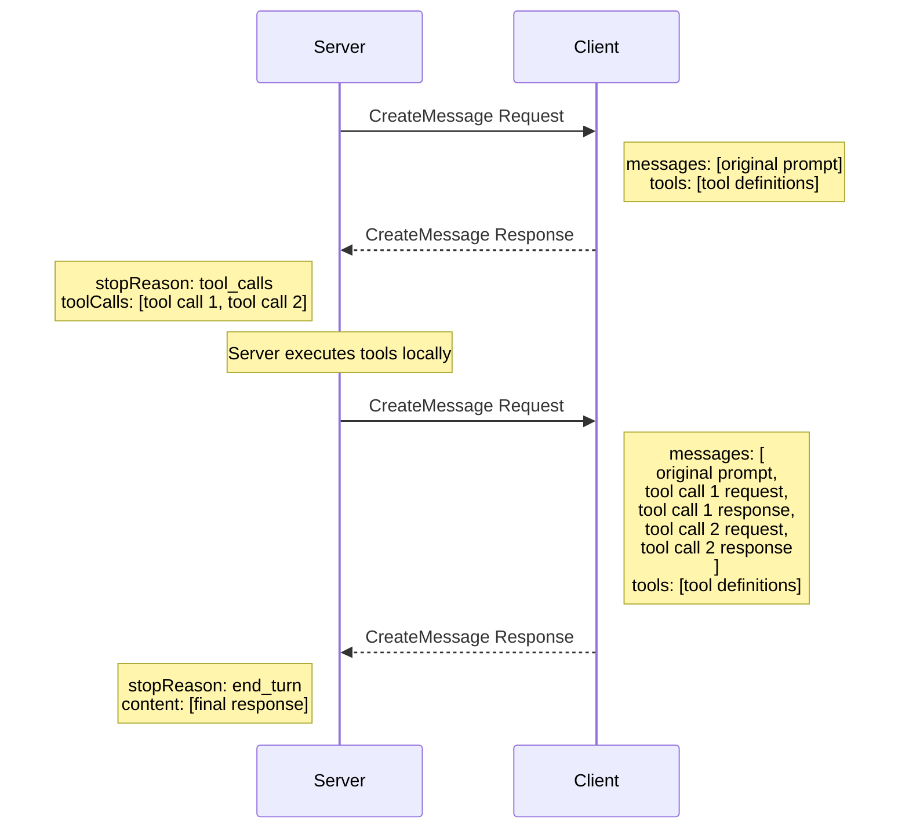

# mcp-whats-new

New features in MCP C# SDK for the [2025-11-25 version of the MCP Specification]:

- [Enhance authorization server discovery with support for OpenID Connect Discovery 1.0](#enhance-authorization-server-discovery-with-support-for-openid-connect-discovery-100)

- [Icons for tools, resources, resource templates, and prompts](#icons-for-tools-resources-resource-templates-and-prompts)

- [Incremental scope consent via WWW-Authenticate](#incremental-scope-consent-via-www-authenticate)

- [Support for URL mode elicitation](#support-for-url-mode-elicitation)

- [Tool calling support in sampling](#tool-calling-support-in-sampling)

- [Support for OAuth Client ID Metadata Documents](#support-for-oauth-client-id-metadata-documents)

- [Support for long-running requests over HTTP with polling](#support-for-long-running-requests-over-http-with-polling)

- [An experimental tasks feature for durable requests with polling and deferred result retrieval](#an-experimental-tasks-feature-for-durable-requests-with-polling-and-deferred-result-retrieval)

See the [Changelog] for the full list of changes.

[2025-11-25 version of the MCP Specification]: https://github.com/modelcontextprotocol.io/specification/2025-11-25
[Changelog]: https://github.com/modelcontextprotocol.io/specification/2025-11-25/changelog

## Enhance authorization server discovery with support for OpenID Connect Discovery 1.0

- Spec change: [PR #797](https://github.com/modelcontextprotocol/modelcontextprotocol/pull/797)
- SDK change: [PR #377](https://github.com/modelcontextprotocol/csharp-sdk/pull/377)

The primary change is that in the 2025-06-18 spec, the server was required to provide a link to its
Protected Resource Metadata (PRM) Document in the `resource_metadata` parameter of the `WWW-Authenticate` header.
In the 2025-11-25 spec, the server can expose the PRM in any of three ways:

1. Via a URL in the `resource_metadata` parameter of the WWW-Authenticate header (as before)
2. At a "well known" URL
    - At the path of the server’s MCP endpoint: https://example.com/public/mcp could host metadata at https://example.com/.well-known/oauth-protected-resource/public/mcp
    - At the root: https://example.com/.well-known/oauth-protected-resource

Clients check for the PRM in these locations in the order listed above.

The MCP C# SDK provides the `AddMcp` extension method of `AuthenticationBuilder` for the server to specify the key fields
for the PRM Document.

```csharp
    .AddMcp(options =>
    {
        options.ResourceMetadata = new()
        {
            ResourceDocumentation = new Uri("https://docs.example.com/api/weather"),
            AuthorizationServers = { new Uri(inMemoryOAuthServerUrl) },
            ScopesSupported = ["mcp:tools"],
        };
    });
```

When the server is configured this way, the SDK hosts the PRM Document at the well-known
location "/.well-known/oauth-protected-resource/" and includes this link in the
`resource_metadata` parameter of the WWW-Authenticate header.

The MCP C# client SDK automatically uses the sequence of steps above to discover the PRM Document and then uses it
to obtain the necessary authorization.

## Icons for tools, resources, resource templates, and prompts

- SEP: [SEP-973](https://github.com/modelcontextprotocol/modelcontextprotocol/issues/973)
- Spec change: [PR #955](https://github.com/modelcontextprotocol/modelcontextprotocol/pull/955)
- SDK change: [PR #802](https://github.com/modelcontextprotocol/csharp-sdk/pull/802)

The 2025-11-25 version of the MCP Specification adds a list of icons to the metadata for Tools, Resources, Prompts.
This icon information is included in the response of a `tools/list`, `resources/list`, or `prompts/list` request.
The Implementation metadata, which describes either a client or a server, has also been extended to include icons and a website URL.
The C# SDK has been updated to support these fields.

The `IconSource` parameter of `McpServerToolAttribute` can be used to specify a single icon URL for a tool.
An example usage is shown below.

```csharp
[McpServerTool(Title = "This is a title", IconSource = "https://example.com/tool-icon.svg")]
public static string ToolWithIcon(
```

The `McpServerResourceAttribute`, `McpServerResourceTemplateAttribute`, and `McpServerPromptAttribute` also have an `IconSource` parameter that can be used similarly to specify a single icon URL for resources, resource templates, and prompts, respectively.

For more advanced icon configuration (multiple icons, MIME type specification, size characteristics),
icons can be specified for a tool programmatically, for example using the `McpServerToolCreateOptions.Icons` property:

```csharp
    .WithTools([
        // EchoTool with complex icon configuration demonstrating multiple icons,
        // MIME types, size specifications, and theme preferences
        McpServerTool.Create(
            typeof(EchoTool).GetMethod(nameof(EchoTool.Echo))!,
            options: new McpServerToolCreateOptions
            {
                Icons = [
                    // High-resolution PNG icon for light theme
                    new Icon
                    {
                        Source = "https://raw.githubusercontent.com/microsoft/fluentui-emoji/main/assets/Loudspeaker/Flat/loudspeaker_flat.svg",
                        MimeType = "image/svg+xml",
                        Sizes = ["any"],
                        Theme = "light"
                    },
                    // 3D icon for dark theme
                    new Icon
                    {
                        Source = "https://raw.githubusercontent.com/microsoft/fluentui-emoji/main/assets/Loudspeaker/3D/loudspeaker_3d.png",
                        MimeType = "image/png",
                        Sizes = ["256x256"],
                        Theme = "dark"
                    },
                    // WebP format for modern browsers, inline Data URI
                    new Icon
                    {
                        Source = "data:image/webp;base64,UklGRiQAAABXRUJQVlA4IBgAAAAwAQCdASoBAAEAAwA0JaQAA3AA/vuUAAA=",
                        MimeType = "image/webp",
                        Sizes = ["32x32"]
                    }
                ]
            }
        )
    ])
```

The `McpServerResourceCreateOptions`, `McpServerResourceTemplateCreateOptions`, and `McpServerPromptCreateOptions` classes have similar `Icons` properties for specifying icons for resources, resource templates, and prompts, respectively.

Finally, the `Implementation` class also has an `Icons` property that can be used to specify icons,
and it has a `Website` property to specify a website URL for the implementation metadata.
These can be set in the `Implementation` object used in the server or client configuration:

```csharp
    .AddMcpServer(options =>
    {
        // Configure server implementation details with icons and website
        options.ServerInfo = new Implementation
        {
            Name = "Everything Server",
            Version = "1.0.0",
            Title = "MCP Everything Server",
            Description = "A comprehensive MCP server demonstrating tools, prompts, resources, sampling, and all MCP features",
            WebsiteUrl = "https://github.com/modelcontextprotocol/csharp-sdk",
            Icons = [
                new Icon
                {
                    Source = "https://raw.githubusercontent.com/microsoft/fluentui-emoji/main/assets/Gear/Flat/gear_flat.svg",
                    MimeType = "image/svg+xml",
                    Sizes = ["any"],
                    Theme = "light"
                },
                new Icon
                {
                    Source = "https://raw.githubusercontent.com/microsoft/fluentui-emoji/main/assets/Gear/3D/gear_3d.png",
                    MimeType = "image/png",
                    Sizes = ["256x256"]
                }
            ]
        };
    })
```

## Incremental scope consent via WWW-Authenticate

- SEP/Spec change: [SEP-835](https://github.com/modelcontextprotocol/modelcontextprotocol/pull/835)
- SDK change: [PR #1084](https://github.com/modelcontextprotocol/csharp-sdk/pull/1084) <!-- TODO: Check -->

Another important feature of the 2025-11-25 version of the MCP Specification is support for incremental scope consent via the `WWW-Authenticate` header.
This feature supports the [Principle of Least Privilege] by allowing clients to request only the minimum level of access needed to perform their tasks.

[Principle of Least Privilege]: https://en.wikipedia.org/wiki/Principle_of_least_privilege

MCP uses OAuth 2.0 for authorization, and in Oauth 2.0, _scopes_ define the level of access a client has to a resource.
Clients request permissions to specific scopes during the authorization process.
With incremental scope consent, a client can start with minimal scopes and request additional scopes as needed.

Since the 2025-06-18 version of the MCP Specification, MCP servers must expose a Protected Resource Metadata (PRM) Document
that may include a `scopes_supported` property that lists the scopes they support.
But clients may not know which scopes are required for specific operations, so might request access to all possible scopes upfront.
The 2025-11-25 version of the MCP Specification describes recommended practices that let MCP clients request access for a minimal set of scopes initially,
and then request additional scopes as needed.

The key practices are:

- **Communicating the initial set of scopes**: When a client makes a request to an MCP server without an `Authorization` header, the server responds with a `401 Unauthorized` status code and includes a `WWW-Authenticate` header. Previously this header included a `resource_metadata` parameter pointing to the PRM Document. Now, it can also include a `scopes` parameter that lists the scopes required for the requested operation.
Clients should request authorization for only these scopes in order to perform the operation.

- **Communicating additional scopes**: When a client makes a request with an `Authorization` header but lacks the necessary scopes for the requested operation, the server responds with a `403 Forbidden` status code. The response should include a `WWW-Authenticate` header with

  - an `error` parameter indicating `insufficient_scope`, and
  - a `scopes` parameter that lists the additional scopes required.

  Clients will typically request a new access token with the scopes specified in the `scopes` parameter and then retry the operation.
  Clients then typically continue using this new access token for subsequent requests until it expires or they encounter another `403 Forbidden` response.

Note that both the client and server must support these practices for incremental scope consent to work effectively.
Here's how the C# SDK helps accomplish this.

### Client support

The MCP C# client SDK automatically handles `WWW-Authenticate` headers with `scopes` parameters in `401 Unauthorized` and `403 Forbidden` responses.
When the client receives such a response, it extracts the required scopes from the `scopes` parameter and requests authorization for those scopes from the authorization server.

### Server support

A prerequisite for supporting incremental scope consent is requiring authentication to the MCP server for some or all operations.
In an MCP server using the MCP C# SDK, this requires:

- Adding authentication services to the application's service collection
- Enabling JWT bearer authentication and configuring the JWT bearer options
- Specifying metadata for the authentication scheme to guide clients on how to obtain access tokens

Once authentication is set up, the server must perform authorization checks on each incoming request,
using the scopes set in the access token sent in the request.

The following sections will describe each of these steps in more detail.

#### Add authentication services

In the `Program.cs` file of the MCP server application, add authentication services to the service collection:

```csharp
builder.Services.AddAuthentication(options =>
{
    options.DefaultAuthenticateScheme = McpAuthenticationDefaults.AuthenticationScheme;
    options.DefaultChallengeScheme = McpAuthenticationDefaults.AuthenticationScheme;
})
```

The authentication services are configured to use the MCP authentication scheme as the default scheme.
ASP.NET Core can be configured with multiple authentication schemes (e.g., JWT Bearer, Cookies, OAuth, etc.),
including dynamically defined custom schemes.
The default scheme determines which scheme to use automatically when no specific scheme is specified.

The MCP authentication scheme is a dynamically defined custom scheme registered by the MCP C# SDK.
The custom scheme defines handlers for both the authentication and challenge processes that are
designed to handle authentication for MCP requests as required by the MCP Specification.

#### Enable JWT bearer authentication

MCP authentication is based on OAuth 2.0 Bearer Tokens, typically implemented as JWTs.
To enable JWT bearer authentication, add the JWT bearer authentication handler to the authentication services:

```csharp
.AddJwtBearer(options =>
```

In the options, you can configure various parameters for validating JWTs, such as the authority, audience, and token validation parameters. The following token validation settings are strongly recommended:

| Setting | Value | Description |
|---------|-------|-------------|
| `ValidateIssuer` | `true` | Ensures the token was issued by a trusted authority |
| `ValidateAudience` | `true` | Verifies the token is intended for this server |
| `ValidateLifetime` | `true` | Checks that the token has not expired |
| `ValidateIssuerSigningKey` | `true` | Confirms the token signature is valid |

You can also use the options to configure handlers for events such as `OnAuthenticationFailed` and `OnTokenValidated` to log authentication failures or perform additional validation.

#### Specify authentication scheme metadata

MCP Servers are required to provide metadata about their authentication scheme to guide clients on how to obtain access tokens
in the form of a Protected Resource Metadata (PRM) Document.
MCP Servers can specify this metadata using the `AddMcp` extension method of `AuthenticationBuilder`:

```csharp
    .AddMcp(options =>
    {
        options.ResourceMetadata = new()
        {
            ResourceDocumentation = new Uri("https://docs.example.com/api/weather"),
            AuthorizationServers = { new Uri(inMemoryOAuthServerUrl) },
            ScopesSupported = ["mcp:tools"],
        };
    });
```

#### Perform authorization checks

After authentication is set up, the MCP server and underlying framework will authenticate incoming requests automatically.
However, the server must also perform authorization checks to ensure the authenticated client has the necessary scopes
to perform the requested operation.

The first step in authorization is to determine the scopes included in the access token passed in the request.
In the MCP C# SDK, the authentication handler extracts the scopes from the JWT and converts them to claims in the `HttpContext.User` property.
However, the way these claims are represented depends on the token issuer and the JWT structure.
For a token issuer that represents scopes as a space-separated string in the `scope` claim,
you can determine the scopes passed in the request as follows:

```csharp
    var user = context.User;
    var userScopes = user?.Claims
            .Where(c => c.Type == "scope" || c.Type == "scp")
            .SelectMany(c => c.Value.Split(' '))
            .Distinct()
            .ToList() ?? new List<string>();
```

With the scopes extracted from the request, the server can then check if the required scope(s) for the requested operation is included with `userScopes.Contains(requiredScope)`.

If the required scope(s) are present, the server can proceed with processing the request. If not, the server should respond with a `403 Forbidden` status code and include a `WWW-Authenticate` header, including an `error` parameter indicating `insufficient_scope` and a `scopes` parameter indicating the scopes required.
It is important to carefully consider which scopes to include in the `scopes` parameter. There are several strategies to choose from, as described in the [MCP Specification](https://modelcontextprotocol.io/specification/2025-11-25/basic/authorization#runtime-insufficient-scope-errors):

- **Minimum approach**: Include the newly-required scopes for the specific operation. Include any existing granted scopes as well, if they are required, to prevent clients from losing previously granted permissions.
- **Recommended approach**: Include both existing relevant scopes and newly required scopes to prevent clients from losing previously granted permissions
- **Extended approach**: Include existing scopes, newly required scopes, and related scopes that commonly work together

To generate the `403 Forbidden` response with the `WWW-Authenticate` header, using the recommended approach for scopes,
you can use the following code snippet:

```csharp
    context.Response.StatusCode = StatusCodes.Status403Forbidden;
    var wwwAuthenticateHeader = new StringBuilder("Bearer ");
    wwwAuthenticateHeader.Append("error=\"insufficient_scope\"");
    wwwAuthenticateHeader.Append($", scopes=\"{string.Join(' ', requiredScopes)}\"");
    context.Response.Headers.Append("WWW-Authenticate", wwwAuthenticateHeader.ToString());
    await context.Response.CompleteAsync();
```

## Support for URL mode elicitation

- SEP: [SEP-1036](https://github.com/modelcontextprotocol/modelcontextprotocol/issues/1036)
- Spec change: [PR #887](https://github.com/modelcontextprotocol/modelcontextprotocol/pull/887)
- SDK change: [PR #1021](https://github.com/modelcontextprotocol/csharp-sdk/pull/1021)

The new URL mode elicitation feature enables secure out-of-band interactions between the server and end-user, bypassing the MCP host/client.
This is particularly valuable for situations requiring the gathering of sensitive data -— like API keys, third-party authorizations,
and payment information—that would otherwise pose a security risk if transmitted through the client.
Inspired by web security standards such as OAuth, this mechanism allows the MCP client to obtain user consent and direct the user’s browser
to a secure server-hosted URL, where the sensitive interaction takes place away from the client application.

To ensure the security and integrity of the elicitation process, the MCP host/client must present the elicitation request to the user,
including the identity of the server requesting the information and the purpose of the elicitation, and provide options for the user
to decline or cancel the elicitation process.
When the user accepts the elicitation request, the client navigates to the provided URL
in a secure manner where the user can complete the necessary interaction.
What the server does at the elicitation URL is outside the scope of MCP. The server could, for example,
present a form for the user to fill out, or redirect the user to a third-party authorization service.

Support for URL mode elicitation is an optional feature of MCP hosts/clients, and clients indicate their support for this feature
in the client capabilities sent in the connection initialization.
Servers should implement fallback mechanisms to handle cases where the client does not support this feature.

### Client support for URL mode elicitation

In the C# SDK, clients can indicate support for URL mode elicitation by setting the `Url` property of `Capabilities.Elicitation`
in the `McpClientOptions` object used to construct the `McpClient`, as shown below:

```csharp
McpClientOptions options = new()
{
    // ... other options ...
    Capabilities = new ClientCapabilities
    {
        Elicitation = new ElicitationCapability
        {
            Url = new UrlElicitationCapability()
        }
    }
```

As with form mode elicitation, the client must provide an `ElicitationHandler` in `McpClientOptions.Handlers`
when constructing the `McpClient`.

```csharp
McpClientOptions options = new()
{
    // ... other options ...
    Handlers = new()
    {
        ElicitationHandler = HandleElicitationAsync,
    }
```

There is only one `ElicitationHandler` for both form mode and URL mode elicitation,
so the handler should begin by checking the `Mode` property of the `ElicitationRequest` parameter
to determine which mode is being requested and handle it accordingly.

```csharp
async ValueTask<ElicitResult> HandleElicitationAsync(ElicitRequestParams? requestParams, CancellationToken token)
{
    // Bail out if the requestParams is null or if the elicitation is not a valid URL mode request
    if (requestParams is null || requestParams.Mode != "url" || requestParams.Url is null)
    {
        return new ElicitResult();
    }
```

### Server support for URL mode elicitation

To support URL mode elicitation, the MCP server must define an endpoint to handle the elicitation response,
and possibly serve the elicitation URL itself.
Typically the elicitation response will be submitted via a POST request to the server,
to ensure that sensitive information is not exposed in URLs or logs.
If the elicitation URL serves a form for user input, it should include anti-forgery tokens to prevent CSRF attacks.
The ASP.NET Core framework provides built-in support for anti-forgery.

In an MCP server written using the C# SDK, one way to implement this is to create a Razor Page that serves
the elicitation URL and handles the elicitation response when the user submits the required information.

```csharp
public class ElicitationFormModel : PageModel
{
    public string ElicitationId { get; set; } = string.Empty;

    public IActionResult OnGet(string id)
    {
        // This method serves the elicitation URL when the user navigates to it
    }

    public async Task<IActionResult> OnPostAsync(string id, string name, string ssn, string secret)
    {
        // This method handles the elicitation response when the user submits the form
    }
}
```

Note that both the `OnGet` and `OnPostAsync` methods accept an `id` parameter. This is because an MCP server
using the Streamable HTTP Transport is inherently multi-tenant, and the server must be able to associate
the elicitation request and response with the correct MCP request.

The server must maintain state to track pending elicitation requests and match them with incoming responses.
Then the responses must be communicated back to the MCP request that initiated the elicitation.
This can be accomplished using in-memory concurrent data structures, a database, or other persistent storage mechanisms.

## Tool calling support in sampling

- SEP: [SEP-1577](https://github.com/modelcontextprotocol/modelcontextprotocol/issues/1577)
- Spec change: [PR #1796](https://github.com/modelcontextprotocol/modelcontextprotocol/pull/1796)
- SDK change: [PR #976](https://github.com/modelcontextprotocol/csharp-sdk/pull/976)

Another major feature of the 2025-11-25 version of the MCP Specification is the addition of tool calling support to sampling.
This allows servers to include tools in their sampling requests, which the LLM may invoke to help produce a response.

This might sound straightforward, since providing tools to LLMs is a central feature of MCP.
But the tools provided in sampling requests are fundamentally different from standard MCP tools,
despite the fact that they are represented using the same MCP Tool metadata structure.
Tools in sampling requests do not need to be, and often are not, implemented as standard MCP tools
by the server. So the server must implement its own logic to handle tool invocations for sampling requests.

It's also important to understand the high-level flow of a sampling request with tools.
When the LLM requests a tool invocation for a sampling request, this is the _response_ to the sampling request.
So the server must perform the tool invocation and then issue a _new sampling request_, including both the tool call request
and the tool call response, to continue the sampling process.
In addition, the LLM may request multiple tool invocations in a single sampling response.
This continues until the LLM produces a final response
-- a response that does not include any tool invocation requests.
The following sequence diagram illustrates this flow:



There is also new logic needed in MCP clients/hosts to handle tool invocations in sampling requests and responses.
This is because MCP client and server use MCP specific messages to represent tool invocation requests and responses,
but most LLMs use their own specific formats for tool invocation requests and responses, and the MCP client/host
must translate between these formats. This can get confusing because many of the structures have similar names (e.g. message, role)
but may have different meanings in MCP and in the LLM's tool calling format.
The client/host must also implement logic to obtain user consent for tool invocations and approve tool responses,
as this is a core principle of MCP tool calling.

With all that said, the MCP C# SDK, in conjunction with the `Microsoft.Extensions.AI` package,
provides comprehensive support for tool calling in sampling requests that abstracts away much of the complexity.
The following sections describe how to use this support in MCP clients/hosts and servers.

### Client/host support for tool calling in sampling

Clients indicate that they support tool calling in sampling by setting the "sampling" property of its client capabilities,
and within that, setting the "tools" property to an empty object.
In the C# SDK, this is done in `Capabilities` property of `McpClientOptions` passed to the `CreateAsync` method of `McpClient`.
Clients that declare support for sampling must also provide a `SamplingHandler` in the `Handlers` property of `McpClientOptions`.
This is illustrated in the code snippet below.

```csharp
// Configure it to connect to the SamplingWithTools MCP server.
var mcpClient = await McpClient.CreateAsync(
    new HttpClientTransport(new()
    {
        Endpoint = new Uri("http://localhost:6184"),
        Name = "SamplingWithTools MCP Server",
    }),
    clientOptions: new()
    {
        Capabilities = new ClientCapabilities
        {
            Sampling = new SamplingCapability
            {
                Tools = new SamplingToolsCapability {}
            }
        },
        Handlers = new()
        {
            SamplingHandler = async (c, p, t) =>
            {
                return await samplingHandler(c, p, t);
            },
        }
    });
```

The `SamplingHandler` is invoked whenever the server sends a sampling request to the client.
The handler must process the sampling request, including any tool invocation requests,
and return the final sampling response to the server.

The `SamplingHandler` could be a difficult piece of logic to implement, depending on the LLM being used.
Fortunately for clients written in C#, there is a sampling handler implementation provided by the
`IChatClient` interface of the `Microsoft.Extensions.AI` package.
You can obtain an `IChatClient` from an LLM chat client using the `AsIChatClient` extension method, as shown below.
Then use the `CreateSamplingHandler` method of `IChatClient` to obtain a sampling handler that understands
how to translate the LLM tool invocation format to and from MCP tool invocation messages.

```csharp
IChatClient chatClient =
    new OpenAIClient(new ApiKeyCredential(token), new OpenAIClientOptions { Endpoint = new Uri(baseUrl) })
        .GetChatClient(modelId)
        .AsIChatClient();

var samplingHandler = chatClient.CreateSamplingHandler();
```

While the sampling handler from IChatClient handles the translation of tool invocation requests and responses,
it does not implement the logic to retrieve user consent for tool invocations and approve tool responses.
To support user consent and approval, you can wrap the sampling handler from IChatClient in a custom sampling handler
that implements this logic. Note that it will be important to cache user approvals to avoid prompting the user multiple times
for the same tool invocation during a single sampling session.

That's all that is needed on the client/host side to support tool calling in sampling requests.

### Server support for tool calling in sampling

Servers can take advantage of the tool calling support in sampling if they are connected to a client/host
that also supports this feature. The capabilities of the client are available in the `McpServer.ClientCapabilities` property.
The following code snippet shows how to check for support for tool calling in sampling.

```csharp
if (_mcpServer?.ClientCapabilities?.Sampling?.Tools is not {})
{
    _logger.LogWarning("PlayCraps: Exit - client does not support sampling with tools");
    return "Error: Client does not support sampling with tools.";
}
```

When a server wants to send a sampling request with tools to the client, it constructs a `CreateMessageRequestParams` object
that includes the list of `Tool` objects to include in the request and sends this to client using the `SampleAsync` method of `McpServer`.
This `Tool` structure is the same as the one used in standard MCP tool metadata,
containing a tool name, description, and parameters schema.
The following code snippet shows a simple example of constructing a Tool object to be included in a sampling request.

```csharp
Tool rollDieTool = new Tool()
{
    Name = "roll_die",
    Description = "Rolls a single six-sided die and returns the result (1-6)."
};
```

But tools included in sampling requests do not need to be implemented as standard MCP tools by the server,
and typically are not. And they work a bit differently from standard MCP tools, in that the input to a sampling tool
is a `ToolUseContentBlock` from the LLM, and the output is list of `ToolResultContentBlock` objects.
So the server must implement its own logic to process tool invocations, dispatching to the appropriate tool implementation based on the tool name.

Unlike a sampling request without tools, the server must implement logic to handle tool invocation requests
sent by the client in response to the sampling request.
Typicially this takes the form of a loop that continues sending sampling requests to the client
until a final response is received (i.e., a response that does not include any tool invocation requests).

When the sampling response from the client includes a tool invocation request, the server must execute the requested tool
and then send a new sampling request to the client that includes:

- The original sampling request messages
- A message representing the tool invocation request
- A message representing the tool invocation response

Note that the sampling response may include multiple tool invocation requests, and the server should execute each requested tool
and include all the tool invocation requests and responses in the next sampling request to the client.

The process repeats, with the collection of messages growing with each tool invocation,
until the client returns a final response.

If all this sounds like a lot of work, that's because it is! Fortunately, the `Microsoft.Extensions.AI` package
again comes to the rescue with support for tool calling in sampling requests.

#### Sampling with tool calling support in Microsoft.Extensions.AI

As with the client/host side, the server side can also use an `IChatClient` from the `Microsoft.Extensions.AI` package
to handle much of the complexity of tool calling in sampling requests. This starts with the [AsSamplingChatClient] method
of `McpServer` that returns an `IChatClient` with support for sampling. This can be extended to support tool calling
with `UseFunctionInvocation`. The following code snippet shows how to set this up.

[AsSamplingChatClient]: https://modelcontextprotocol.github.io/csharp-sdk/api/ModelContextProtocol.Server.McpServer.html#ModelContextProtocol_Server_McpServer_AsSamplingChatClient_System_Text_Json_JsonSerializerOptions_

```csharp
IChatClient chatClient =
    ChatClientBuilderChatClientExtensions.AsBuilder(_mcpServer.AsSamplingChatClient())
    .UseFunctionInvocation()
    .Build();
```

Tools can then be described as `AIFunctions`, created with `AIFunctionFactory.Create` and passed to the `IChatClient`
in the `ChatOptions` of `GetResponse`. The whole sequence looks like this:

```csharp
AIFunction rollDieTool = AIFunctionFactory.Create(
    () => Random.Shared.Next(1, 7),
    name: "roll_die",
    description: "Rolls a single six-sided die and returns the result (1-6)."
);

var chatOptions = new ChatOptions
{
    Tools = [rollDieTool],
    ToolMode = ChatToolMode.Auto
};

// Come out roll
var pointRollResponse = await chatClient.GetResponseAsync(
    "<Prompt that may use the roll_die tool>",
    chatOptions,
    cancellationToken
);
```

The `IChatClient` handles the details of sending sampling requests with tools to the client,
processing tool invocation requests in the sampling responses, executing the requested tools,
and sending new sampling requests with the tool invocation requests and responses,
including translating between MCP tool invocation messages and the LLM's tool invocation format.

These are the key aspects of the server-side logic for sampling requests with tools using the MCP C# SDK.

## Support for OAuth Client ID Metadata Documents

- SEP: [SEP-991](https://github.com/modelcontextprotocol/modelcontextprotocol/issues/991)
- Spec change: [PR #1296](https://github.com/modelcontextprotocol/modelcontextprotocol/pull/1296)
- SDK change: [PR #1023](https://github.com/modelcontextprotocol/csharp-sdk/pull/1023)

The 2025-11-25 version of the MCP Specification adds support for [OAuth Client ID Metadata Documents], or CIMDs.
CIMD is an alternative to Dynamic Client Registration (DCR) for registering a client with an authorization server
when the client and server have no prior relationship (most common), and is now the preferred method in MCP.

The basic idea of CIMD is that the client specifies a URL as its client_id in requests to the Authorization Server;
that URL resolves to a JSON document hosted by the client that contains its metadata, such as identifiers and other descriptive information needed by the server.
When an authorization server encounters such a client_id, it dereferences the URL, retrieves the metadata document, and uses the information
it finds there to understand and apply policy to the client.
The complete flow is shown in the [MCP Specification](https://modelcontextprotocol.io/specification/2025-11-25/basic/authorization#client-id-metadata-documents-flows).

[OAuth Client ID Metadata Documents](https://datatracker.ietf.org/doc/html/draft-ietf-oauth-client-id-metadata-document-00)

Currently just a few Authorization Servers support CIMD, but it is viewed as an easier and more flexible alternative to DCR,
so it is expected that more Authorization Servers will add support for it over time.

In the MCP C# SDK, clients can specify a CIMD URL in the `ClientMetadataDocumentUri` property of the `ClientOAuthOptions` object
specified when constructing the `HttpClientTransport` for connecting to the MCP server:

```csharp
const string ClientMetadataDocumentUrl = $"{ClientUrl}/client-metadata/cimd-client.json";

await using var transport = new HttpClientTransport(new()
{
    Endpoint = new(McpServerUrl),
    OAuth = new ClientOAuthOptions()
    {
        RedirectUri = new Uri("http://localhost:1179/callback"),
        AuthorizationRedirectDelegate = HandleAuthorizationUrlAsync,
        ClientMetadataDocumentUri = new Uri(ClientMetadataDocumentUrl)
    },
}, HttpClient, LoggerFactory);
```

The CIMD URL must use the HTTPS scheme and must have a non-empty path component.
It also cannot contain single-dot or double-dot path segments or a fragment component.
These are requirements specified in the [OAuth Client ID Metadata Documents] spec.

It is the responsibility of the client to host the CIMD document at the specified URL.
The metadata document MUST include at least the following properties: `client_id`, `client_name`, and `redirect_uris`.
Other properties commonly included are `client_uri`, `logo_uri`, `grant_types`, and `response_types`.

When the client specifies a CIMD URL in its OAuth options, the MCP C# SDK will attempt to use CIMD to register the client
with the Authorization Server.
If the Authorization Server does not support CIMD, the client will fall back to using Dynamic Client Registration (DCR)
if DCR is enabled in the OAuth options.

## Support for long-running requests over HTTP with polling

- SEP: [SEP-1699](https://github.com/modelcontextprotocol/modelcontextprotocol/issues/1699)
- SDK change: In progress

## An experimental tasks feature for durable requests with polling and deferred result retrieval

- SEP: [SEP-1686](https://github.com/modelcontextprotocol/modelcontextprotocol/issues/1686)
- SDK change: In progress
